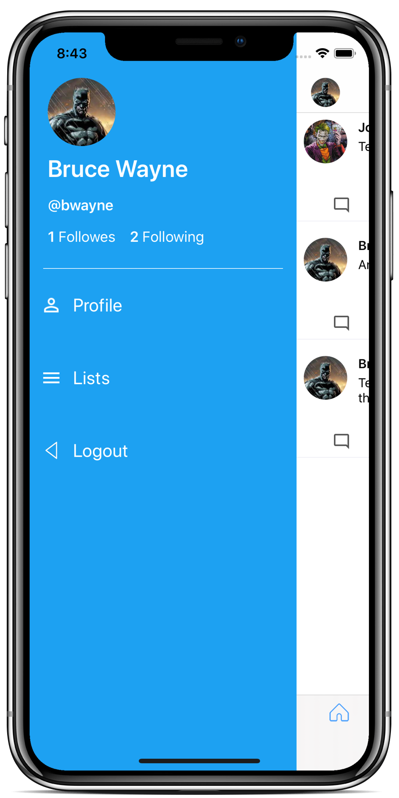

# TwitterCl - Twitter iOS clone.

Twitter iOS Clone made using Swift 5 and Firebase Realtime Database. Original idea and most of the source code is taken from [this](https://www.udemy.com/course/twitter-ios-clone-swift/) Udemy course.  

### My contributions: ###
* Loading animations
* Side Menu
* Various UI and UX improvements

### Technologies Used: ###
* Swift 5
* Firebase

&nbsp;&nbsp;&nbsp;&nbsp;&nbsp;&nbsp;&nbsp;&nbsp;&nbsp;&nbsp;&nbsp;&nbsp;&nbsp;&nbsp;

